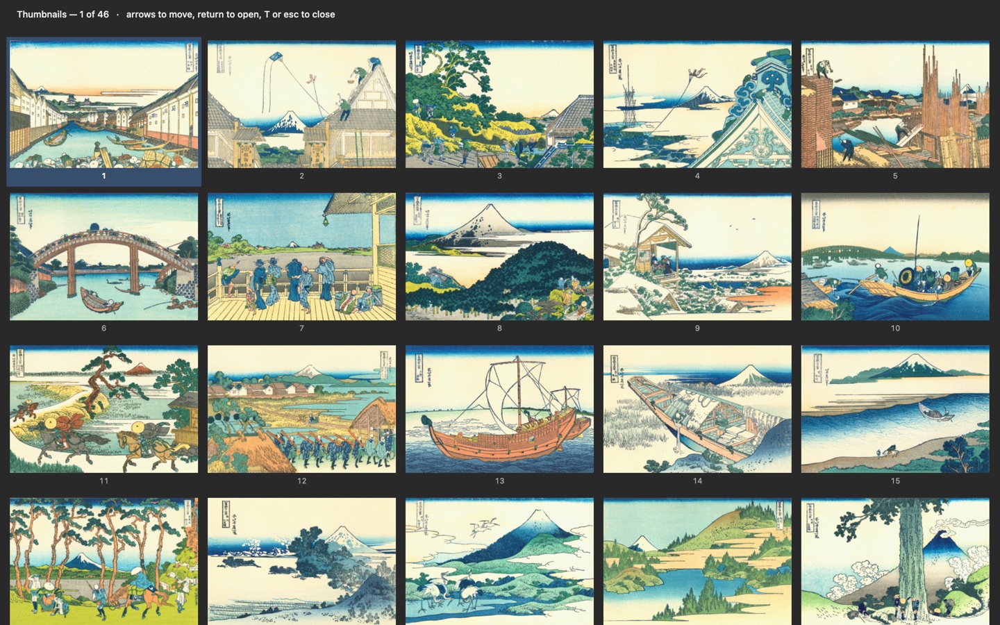
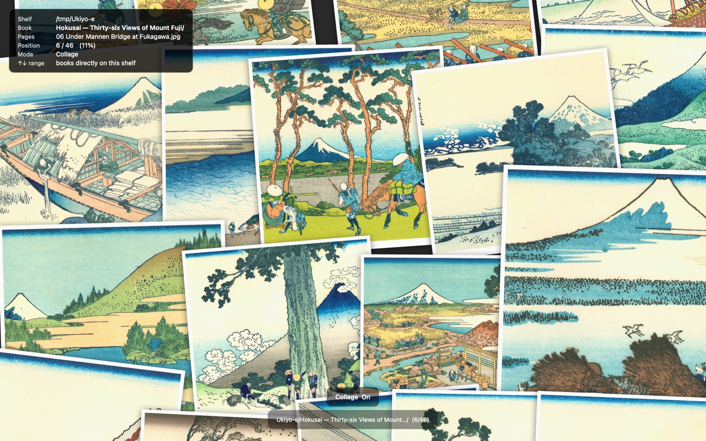

# Pina Viewer

A keyboard-driven image and comic viewer for macOS. Point it at a folder or an
archive and read. There is no library to build and nothing to import.

## Why another viewer

Most viewers make you go back to the Finder to open the next book. This one
doesn't. `↑` and `↓` move between books on the same shelf, so a whole folder
tree reads as one continuous thing without ever leaving full screen.

- **Shelf → book → page.** A folder or an archive is a book; the images and
  videos directly inside it are its pages. The shelf is worked out from where
  you opened, so `↑` `↓` always mean something sensible.
- **Videos are pages, not a separate mode.** A folder holding both stills and
  clips just works — `←` `→` walk through everything in order, and a video
  gets a poster frame in the thumbnail grid like any other page.
- **Two-page spread, right-bound or left-bound.** Manga reads the way it should,
  and you can nudge the pairing by one page when a cover throws it off.
- **Archives open directly.** zip, cbz, rar, cbr, 7z, cb7 — and PDFs. Nothing is
  permanently unpacked to disk.
- **Native and small.** About 1.6 MB, universal (Apple silicon and Intel),
  signed and notarized. No Electron, no background daemon, no telemetry.

## Install

    brew tap lynthey/tap
    brew trust lynthey/tap
    brew install --cask pina-viewer

`brew trust` is required for third-party taps on Homebrew 6 and later; without
it the install stops with "Refusing to load cask from untrusted tap".

Or download the zip from [Releases](https://github.com/lynthey/pina-viewer/releases),
unpack it, and move `Pina Viewer.app` into `/Applications`.

Requires macOS 13 (Ventura) or later.

## Keys

| Key | |
|---|---|
| `←` `→` | Previous / next page |
| `↑` `↓` | Previous / next book on the shelf |
| Left / right click | Next / previous page |
| `Space` | Next page — or play/pause on a video |
| `F` | Full screen |
| `W` | Fit height ↔ fit width |
| `2` | One page or two |
| `B` | Right-bound ↔ left-bound |
| `T` | Thumbnail grid |
| `C` | Collage wall |
| `S` | Slideshow |
| `D` | Sorting — pick pages and delete them |
| `I` | Info overlay |
| `?` | Everything else |

Every binding can be changed in Settings.

## More than one way to look

**Thumbnail grid** — the whole book at a glance, in three sizes.

**Collage wall** — pictures drifting past, for finding something you cannot name.

**Slideshow** turns pages on its own, either scrolling or fading. **Sorting**
lets you step through and mark what to throw away, then delete in one go.

## Formats

| | |
|---|---|
| Images | jpg jpeg jpe jfif png gif webp heic heif avif bmp tif tiff tga |
| Video | mp4 m4v mov |
| Archives | zip cbz rar cbr 7z cb7 |
| Documents | pdf |

Formats AVFoundation cannot play — avi, mkv, webm, wmv, flv — are listed but not
played, so you can see what is there and convert it rather than wonder where it
went. They can be hidden in Settings.

## Settings

Everything, including key bindings, lives in one readable file:

    ~/.config/pina-viewer/settings.json

Sorted keys, plain JSON — it can go straight into your dotfiles.

## Support

This is a one-person project with no company behind it. If it earns a place in
your day, you can [sponsor it](https://github.com/sponsors/lynthey). Everything
here stays free either way.

## About the screenshots

The book shown is Hokusai's *Thirty-six Views of Mount Fuji* (c. 1830–33), in the
public domain, from [Wikimedia Commons](https://commons.wikimedia.org/wiki/Category:36_Views_of_Mount_Fuji).

## License

MIT, except the bundled UnRAR source code, which is covered by its own terms.
The full text ships inside the app at `Contents/Resources/LICENSE.txt` and is in
[LICENSE](LICENSE).
